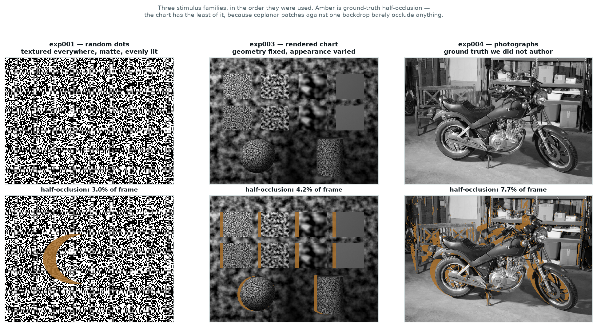
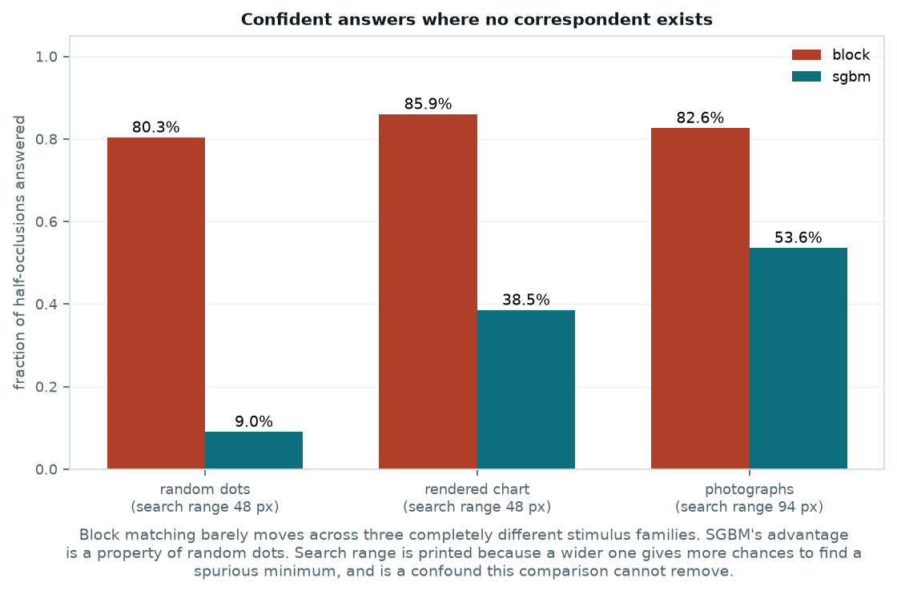
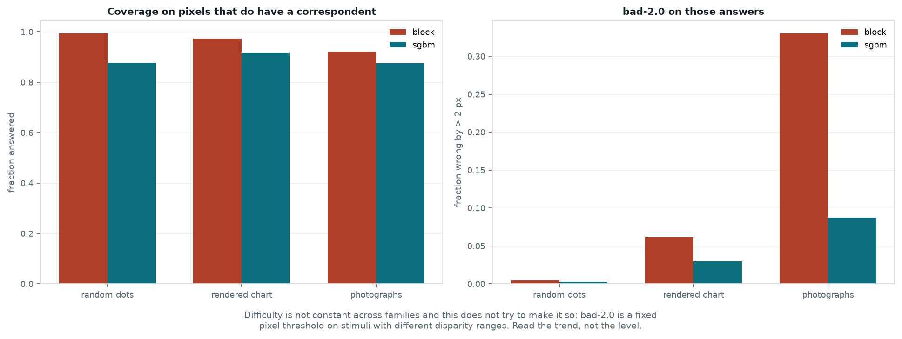
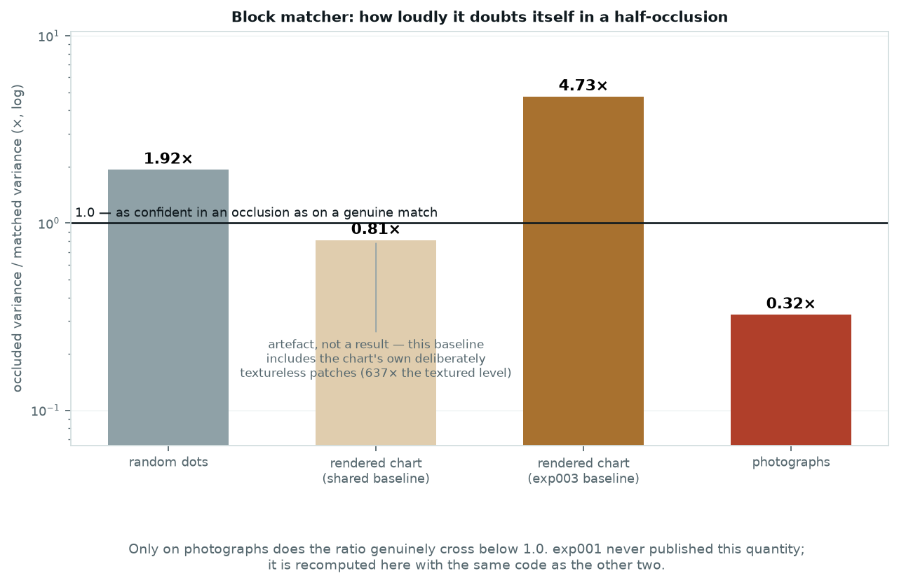
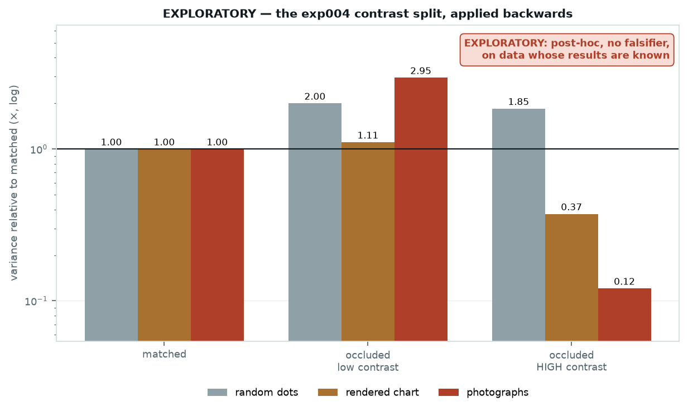

# Synthetic → rendered → real · five slides

A **synthesis, not an experiment.** No hypotheses, no falsifiers. It re-scores
exp001, exp003 and exp004's stimuli through one implementation
(`src/activestereo/metrics.py`) so their numbers can sit in the same table, and
cross-checks itself against each published record before drawing anything.

Regenerate:

```bash
python scripts/make_comparative_figures.py
python scripts/build_deck.py slides/comparative_stimulus_families
```

Records of record:
[exp001](../../experiments/exp001_matcher_baseline/findings.md) ·
[exp003](../../experiments/exp003_appearance_and_matching/findings.md) ·
[exp004](../../experiments/exp004_real_data_transfer/findings.md).

**What is comparable.** Rates and ratios travel between families. Absolute errors
do not — rigs, depth ranges, image sizes and disparity ranges all differ. The
search range is printed beside every family because a matcher searching 247
candidates has more chances to find a spurious minimum than one searching 48, and
this comparison cannot remove that.

---

## Slide 1 — Three families, one question



| | exp001 | exp003 | exp004 |
|---|---|---|---|
| Stimulus | random-dot stereogram | rendered material chart | photographs |
| Ground truth | placed by us | traced by us | measured by a scanner |
| Built for | proving depth came from matching | isolating appearance | transfer to real imagery |
| Half-occluded pixels | 2 284 | 12 863 | 32 953 |
| Search range | 48 px | 48 px | 80–247 px |

Each was the right stimulus for its own question. Together they answer one none of
them asked: **which of this framework's results are about stereo vision, and which
are about the stimuli we happened to build?**

The cross-check that gates every figure here:

| record | published | recomputed |
|---|---|---|
| exp001 block hallucination | 0.796 | 0.803 |
| exp001 sgbm hallucination | 0.090 | 0.090 |
| exp003 occluded variance ratio | 4.7× | 4.73× |
| exp004 block hallucination | 0.826 | 0.826 |
| exp004 block variance ratio | 0.324 | 0.324 |

The script refuses to plot if any of these disagrees. Shared metrics exist to
unify these experiments, so a disagreement would be a bug in the unification, not
a discovery.

---

## Slide 2 — What transferred, and what was an artefact of random dots



**Block matching barely moves.** 80.3% → 85.9% → 82.6% across three stimulus
families with nothing in common. Filling half-occlusions with confident answers is
a property of winner-take-all SSD matching, not of any stimulus.

**SGBM's advantage does not survive contact with anything real.**

| matcher | random dots | rendered chart | photographs |
|---|---|---|---|
| block | 80.3% | 85.9% | 82.6% |
| **sgbm** | **9.0%** | **38.5%** | **53.6%** |

exp001's practical recommendation — prefer SGBM, because it declines where block
matching guesses — rests on the number that moves most. It degrades **four-fold**
on the first non-synthetic stimulus and **six-fold** on photographs.

This is the clearest case in the project of a synthetic stimulus flattering one
method. Random dots give every pixel a locally unique signature, which is exactly
what SGBM's uniqueness and consistency constraints are built to exploit. Real
scenes have smooth regions and repeated structure, and the advantage thins.

Filed as [#10](https://github.com/visgraf/active-stereo/issues/10); it needs its
own pre-registered test before it counts as a result.

### The ordinary metrics, for context



Coverage on pixels that *do* have a correspondent degrades gently — 0.993 → 0.973
→ 0.922 for block matching. Error does not: bad-2.0 goes 0.004 → 0.062 → 0.330.
That gap is the whole story in miniature. **The matcher keeps answering just as
readily while becoming far less right**, and nothing in its coverage would tell
you. Note that these are fixed pixel thresholds on stimuli with different
disparity ranges, so the trend is the readable part, not the level.

---

## Slide 3 — The uncertainty, and one honest complication



This is the figure most able to mislead, so the chart appears twice.

Under the shared definition the chart reads **0.81×**, which looks like the same
anti-calibration exp004 found on photographs. It is not. exp003's chart
deliberately contains textureless patches whose reported variance is 637× the
textured level, and pooling those into the "matched" baseline swamps it. Under
exp003's own textured baseline the chart is **4.73×** — correctly directioned,
merely too small, exactly as exp003 reported.

Plotting only the shared number would have manufactured a tidy monotone trend out
of one stimulus's design.

With that resolved, the honest reading is **not** a gradient:

| family | occluded / matched |
|---|---|
| random dots | 1.92× |
| rendered chart (exp003 baseline) | 4.73× |
| **photographs** | **0.32×** |

Only on photographs does the ratio cross below 1.0. On the other two the matcher
is at least *less* sure where it is fabricating — insufficiently so, which is what
exp003 said, but with the sign the right way round.

**A note on conventions.** exp003 summarises as a ratio of medians; exp004 as a
median of per-scene ratios. On the same pixels those give 4.73 and 4.05. Neither
is wrong. Each record is reproduced in the convention it was written in, rather
than imposing one and quietly disagreeing with both.

---

## Slide 4 — The effect was in the rendered data all along



exp004's decisive control was splitting half-occlusions by local image contrast.
Applying it backwards, now that one implementation can:

| family | occluded, low contrast | occluded, HIGH contrast |
|---|---|---|
| random dots | 2.00× | **1.85×** |
| rendered chart | 1.11× | **0.37×** |
| photographs | 2.95× | **0.12×** |

**The anti-calibration is already there on the rendered chart** — 0.37×, well below
1.0, in data collected in exp003 and analysed without ever looking at this cell.
It is *absent* on random dots, where high-contrast occlusions still carry 1.85×.

There is a mechanical reason, and it is the same one exp004 gave. A half-occluded
pixel beside a strong edge produces a sharp cost minimum at the wrong disparity,
and curvature reads sharpness as precision. **Random dots have no edges** — no
coherent object boundaries, only noise — so the failure has nowhere to occur. The
moment a stimulus contains rendered objects with boundaries, it appears.

So the progression is not "results degrade toward realism". It is:

> The failure needs *structure* to exist. Random dots cannot exhibit it. Renders
> can, and did, and we did not look. Photographs make it worse.

**This is exploratory** — post-hoc, no falsifier, computed on data whose results
are already known. If it survives a proper test it reframes exp003's conclusion,
which called the chart's occlusion variance "under-inflated" when in its
high-contrast cell it was already inverted. That test needs its own issue.

### What the three experiments together support

1. **Confident filling of half-occlusions is real and stimulus-independent** —
   three families, 80–86% for block matching.
2. **Anti-calibration needs edges**, so it was invisible to the stimulus family
   the project started with.
3. **Comparing matchers on synthetic stimuli can rank them by how well they
   exploit synthetic statistics.** SGBM 9.0% → 53.6%.
4. **The remedies do not depend on which family you believe**:
   [#7](https://github.com/visgraf/active-stereo/issues/7) left-right consistency,
   [#8](https://github.com/visgraf/active-stereo/issues/8) a variance proxy that
   can express "no correspondent exists".

---

## Slide 5 — Postscript: a second matcher family crossed the ladder

*(Added 2026-08-20. These are registered results from exp006's findings — same
`metrics` module, pre-registered falsifiers, a validity gate — not re-scored
here. Briefing: `docs/briefings/exp005-exp006-energy-pathway.md`.)*

Everything on the previous slides came from one matcher family: cost
minimisation, confidence from cost curvature. That left a live hypothesis —
maybe the anti-calibration was the *readout's* fault, and a population-profile
variance would escape it. The energy pathway (exp005 → exp006) then crossed the
same ladder:

| | random dots | photographs |
|---|---|---|
| median error vs block | **0.10×** (0.0074 px) | ~1.4× (0.72 px vs 0.52 px) |
| error under interocular gain sweep | ×1.0000 (block: ×1.02–1.07) | ×1.04 exposure (block: ×44) |
| half-occlusions answered | — | **91%** (block: 83%) |
| hi-contrast occluded / matched variance | — | **0.25×**, inverted in 7/8 scenes |

Two additions to the story:

1. **The anti-calibration is in the evidence, not the readout.** A variance
   built to express "the evidence is spread everywhere" inverts in the same
   cell, with the same low/high contrast asymmetry, as cost curvature. The
   sharp-wrong evidence beside an edge is sharp for any per-pixel statistic.
   The remedies stay structural: left-right consistency (#7), an occlusion
   model — not a better formula (#8).
2. **Accuracy and occlusion honesty are different axes.** The multi-scale
   pooling that lifted the pathway from chance to block-level accuracy is the
   same pooling that carries support across occlusion boundaries — it answers
   *more* half-occlusions than any matcher measured, not fewer. Improving one
   axis bought nothing on the other.

---

## Caveats to keep on hand

- **Not an experiment.** No falsifiers were registered and none are claimed. Every
  new observation here needs its own pre-registered test.
- **Difficulty is not held constant** and this does not pretend otherwise. The
  window is fixed at 7 px; the disparity range follows each scene, from 48 to 247.
  A wider range is more chances to find a spurious minimum.
- **bad-2.0 is a fixed pixel threshold on stimuli with different disparity
  ranges.** Read the trend, not the level.
- **The chart has the least occlusion of the three** — coplanar patches against one
  backdrop barely occlude anything — so its occlusion statistics rest on fewer
  pixels (12 863, against 32 953 for photographs).
- **exp001 never published a variance ratio.** The 1.92× here is a new quantity
  computed with the same code as the others, not a number from its findings.
- **exp001's own pipeline applies `confine_to_fovea`**, which adds an eccentricity
  penalty to variance and never touches values. Its published hallucination rate
  is therefore reproducible without it; its variance would not be.
- **SGBM's variance ratio is 1.000 in every family by construction** — it returns a
  constant. That is [#9](https://github.com/visgraf/active-stereo/issues/9), not a
  result.
