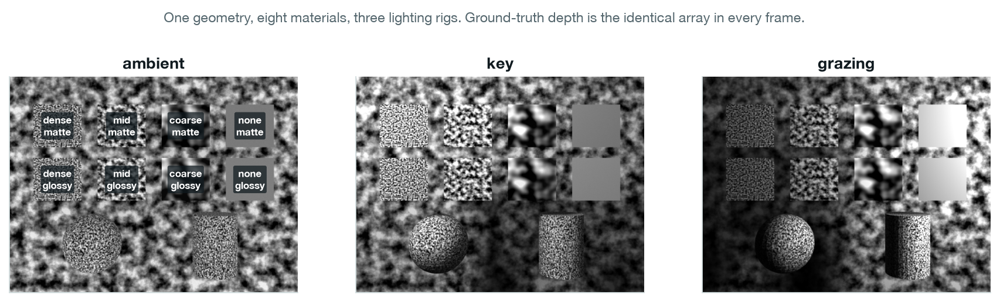
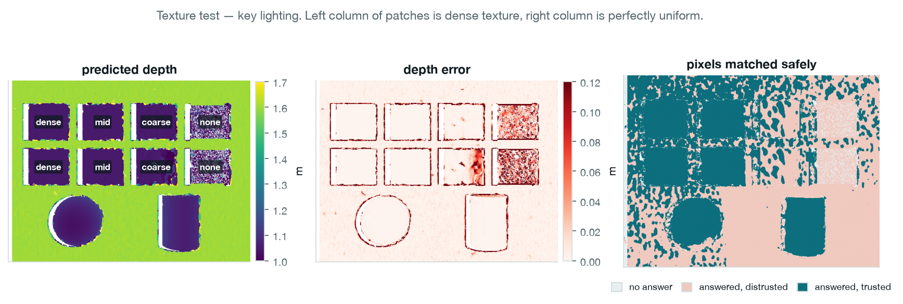
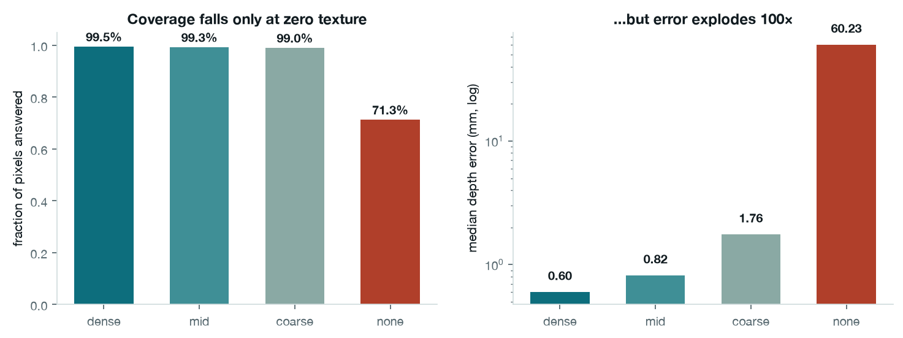
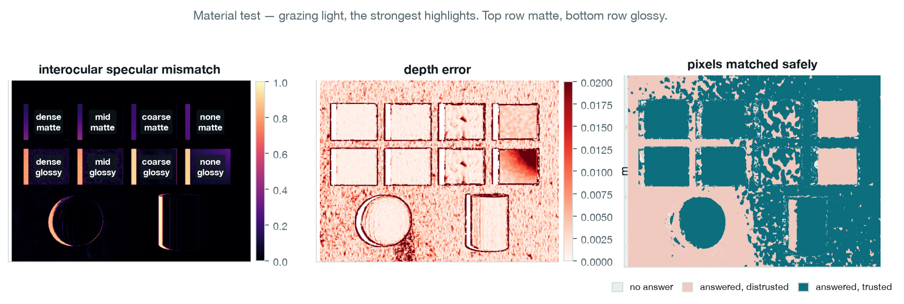
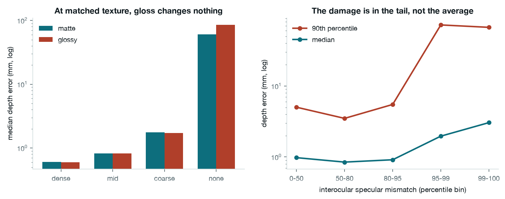
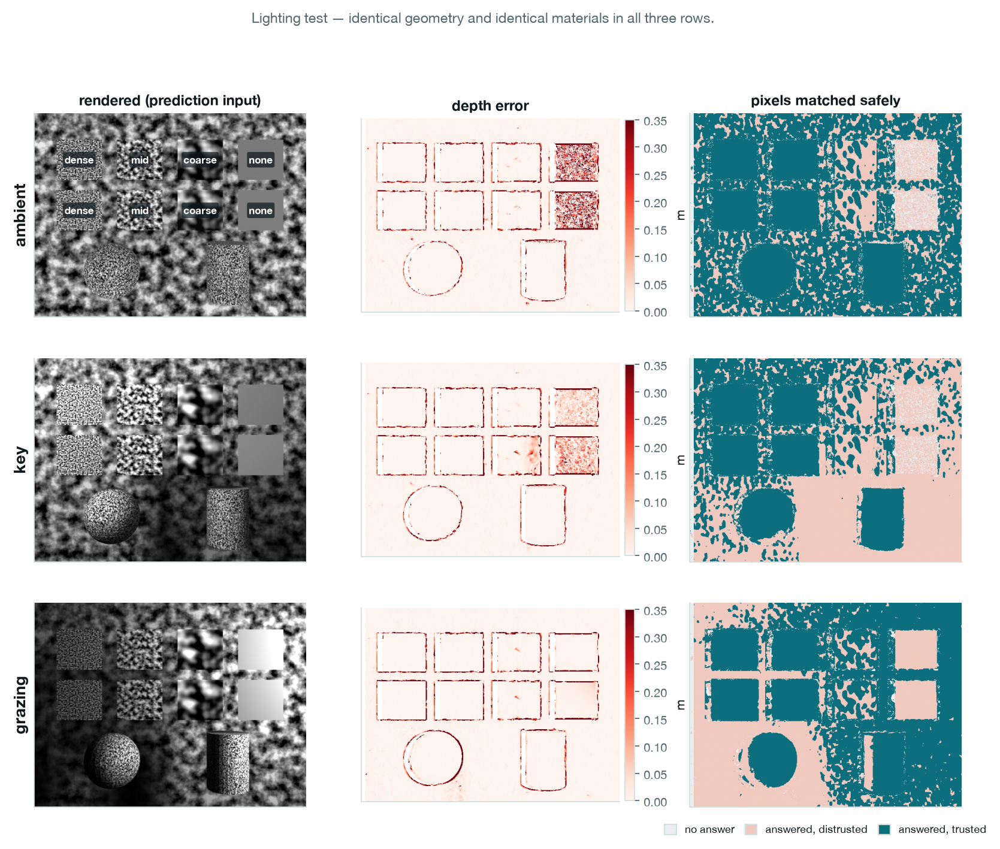
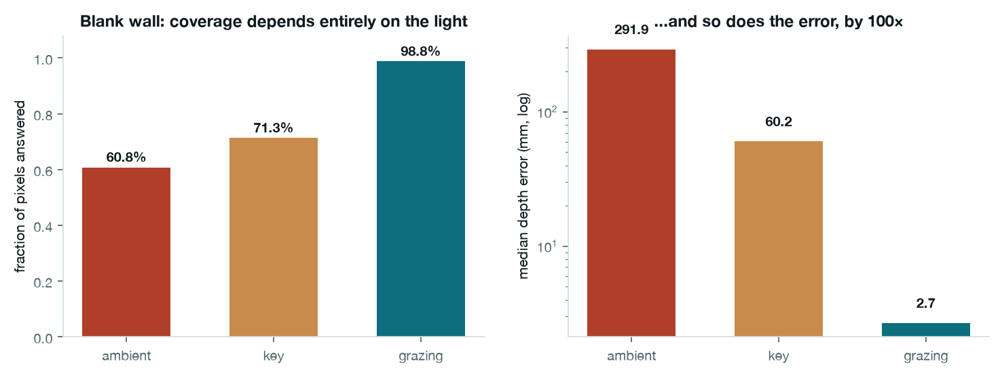
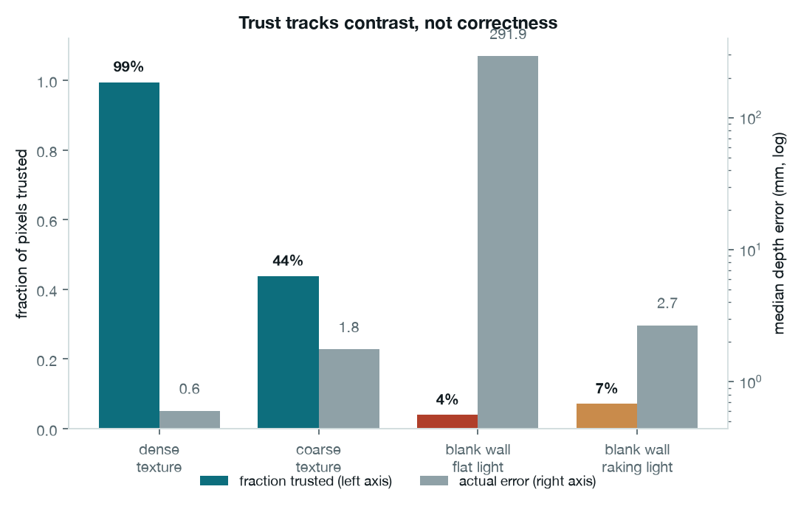
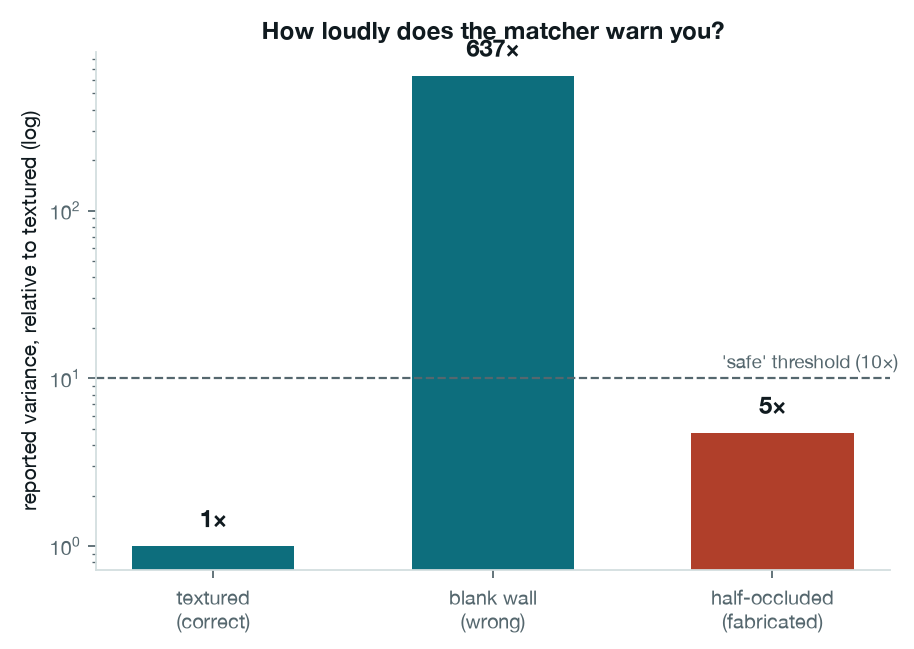

# exp003 — Appearance and matching · four slides

Source of truth for every number:
[`experiments/exp003_appearance_and_matching/findings.md`](../../experiments/exp003_appearance_and_matching/findings.md)
· run `exp003-20260816T131125-3fe9985` · issue
[#4](https://github.com/visgraf/active-stereo/issues/4).

Regenerate all figures and `data.json`:

```bash
python scripts/make_exp003_slides.py
```

Block matcher (`d48_w7`) throughout, medians over 12 renders (3 lighting × 4
permutations). "Trusted" means answered **and** reported variance within 10× the
well-textured baseline measured in the same frame — a display threshold for these
slides, not a value the pipeline uses.

---

## Slide 1 — The plan

### Motivation

Every result so far came from a **random-dot stereogram**: textured everywhere,
matte, evenly lit. Correct for proving a depth estimate came from binocular
matching — and nothing like a real scene. Two real-world failures cannot occur on
random dots:

- **No texture** (a painted wall) — the evidence is *absent*.
- **Shiny surfaces** — a highlight is a reflection, so it sits at a *different
  physical point in each eye*. The evidence is *fabricated*.

Which is worse, and what does the system do when it meets them?

### Strategy — geometry fixed, appearance varying

Rendering one realistic scene cannot answer this: if matching fails on a shiny,
untextured, curved object in shadow, you cannot say which factor caused it.

So: **eight flat patches, all at exactly 1.05 m**, against a textured backdrop at
1.6 m. Identical shape, distance and occlusion for every patch. The ground-truth
depth map is *literally the same array* in every condition — so any difference in
performance is caused by appearance and nothing else.

Two safeguards:

- **Texture is measured, not assumed** — read from the renderer's albedo pass
  (lighting stripped out), because under a raking light a uniform wall shows a
  brightness ramp that looks like texture in the photograph but supports matching
  far more weakly.
- **Materials rotate between positions** across 4 permutations, so "no texture"
  is not confounded with "far from image centre" — the variable this framework is
  most sensitive to.

### The three tests

| Test | Varies | Held fixed |
|---|---|---|
| **Texture** | albedo contrast: 0.193 → 0.175 → 0.072 → 0.000 | finish, lighting, geometry |
| **Material** | matte (roughness 1.0) vs glossy (0.15) | albedo contrast, lighting, geometry |
| **Lighting** | flat ambient · directional key · raking grazing | materials, geometry |



> **Say:** the whole design is one sentence — hold the shape still, change only
> the paint and the light.

---

## Slide 2 — Test 1: Texture

**Headline: the matcher does not decline when evidence runs out. It answers, and
it is wrong by 100×.**





| Albedo contrast | Answered | Trusted | Depth error | Variance |
|---|---|---|---|---|
| 0.193 dense | 99.5% | 99.4% | 0.60 mm | 28 px² |
| 0.175 mid | 99.3% | 99.1% | 0.82 mm | 94 px² |
| 0.072 coarse | 99.1% | 38.9% | 1.76 mm | 1,281 px² |
| **0.000 uniform** | **71.3%** | **4.2%** | **60.23 mm** | **53,346 px²** |

### What to point at

- **Coverage barely moves; error explodes.** 99.5% → 71.3% answered, but
  0.60 mm → 60.23 mm error. The prediction was that it would *decline*; it
  doesn't.
- **The ladder is really two rungs, not four.** 0.193 / 0.175 / 0.072 are
  indistinguishable in outcome. Everything happens between 0.07 and 0.00, where
  we took no measurements — a design flaw to fix next time, not a result.
- **But look at the "trusted" column.** Only 4.2% of uniform-patch answers are
  trusted. The matcher is wrong *and it says so* — variance inflates 637× against
  ~100× error inflation. Downstream fusion weights by inverse variance, so these
  are discounted automatically.
- **Coarse texture is already over-cautious**: 38.9% trusted at 1.76 mm error.
  Trust is falling faster than accuracy.

> **Say:** wrong answers that arrive labelled "I'm guessing" are survivable. Hold
> that thought for slide 4.

---

## Slide 3 — Test 2: Material

**Headline: specularity did nothing to the average, and 14× damage in the tail.**





| Albedo contrast | Matte error | Glossy error | Matte spec. mismatch | Glossy spec. mismatch |
|---|---|---|---|---|
| 0.193 dense | 0.601 mm | 0.601 mm | 0.004 | 0.062 |
| 0.175 mid | 0.820 mm | 0.827 mm | 0.004 | 0.062 |
| 0.072 coarse | 1.760 mm | 1.714 mm | 0.004 | 0.037 |
| 0.000 uniform | 60.23 mm | 85.12 mm | 0.004 | 0.057 |

At matched texture the difference is ≤ 7 µm, against a permutation noise floor of
127 mm. **The prediction failed.**

### Post-hoc — where the highlights actually are

Not a test of the hypothesis; an observation that generates the next one.
361,373 textured glossy pixels, binned by *measured* interocular specular
mismatch:

| Mismatch percentile | Range | Median error | 90th percentile |
|---|---|---|---|
| 0–50 | 0.000–0.061 | 0.98 mm | 5.03 mm |
| 50–80 | 0.061–0.147 | 0.85 mm | 3.50 mm |
| 80–95 | 0.147–0.377 | 0.91 mm | 5.50 mm |
| **95–99** | 0.377–0.672 | 1.96 mm | **72.50 mm** |
| **99–100** | 0.672–0.918 | 3.05 mm | **67.07 mm** |

Overall Spearman(mismatch, error) = **−0.004** — no monotone relationship. But
above the 95th percentile the 90th-percentile error jumps **14-fold**.

### What to point at

- The design worked: albedo contrast *is* matched across the roughness axis, so
  this is a clean comparison of reflectance.
- Roughness 0.15 makes highlights that are sharp but small — a few percent of
  each patch. A patch median cannot see them.
- **The mechanism is real; the instrument was wrong.** Needs its own
  pre-registered test on the p90, with larger highlights.

> **Say:** a null result that tells you your measurement was mis-specified is
> still worth having — provided you say which it was.

---

## Slide 4 — Test 3: Lighting

**Headline: the same blank wall is unmatchable or nearly perfect depending only
on where the lamp is.**





Identical geometry, identical materials in all three rows. Only the lamp moves.

| Lighting | Blank wall answered | Blank wall error | Trusted | Variance |
|---|---|---|---|---|
| flat ambient | 60.8% | **291.88 mm** | 3.9% | 33,398 px² |
| directional key | 71.3% | 60.23 mm | 4.3% | 68,166 px² |
| **raking grazing** | **98.8%** | **2.68 mm** | 7.1% | 230,156 px² |

A raking light **rescues** a textureless surface: the shading gradient becomes
matchable structure, and error drops from 292 mm to 2.68 mm — comparable to a
genuinely textured patch. Well-textured patches are unaffected by lighting
(0.60–0.61 mm in all three).

### The synthesis — and the real finding



Compare the last two bars. Nearly the same trust (4% vs 7%), errors differing by
**100×** (292 mm vs 2.7 mm). Under raking light the matcher is *accurate and does
not believe itself*.

So what the reported variance actually tracks is **image contrast, not
correctness** — exactly what a cost-curvature proxy would do. That gives three
distinct regimes:

| Regime | Answer | Trust | Consequence |
|---|---|---|---|
| Textured | right | trusted | works |
| Blank wall, any light | wrong *or right* | distrusted | safe, sometimes wasteful |
| **Half-occluded** | **fabricated** | **trusted (5×)** | **poisons fusion** |



### Implications

1. **Build occlusion detection before a texture gate.** The instinct after slide 2
   is a "reject low-contrast regions" rule. The variance figures say that hardens
   the case the system already survives. Occlusion is the exposure — 5×
   inflation for a fabricated measurement.
2. **Contrast normalisation (NCC, census) is not the fix either** — it targets
   brightness differences between the eyes, which slide 3 shows is not the
   binding constraint.
3. **A texture gate is still worth having, for a different reason:** spending gaze
   on unresolvable regions wastes effort in the active-sampling loop, even when
   the estimates are harmless downstream.
4. **For the paper:** not "robust to difficult surfaces" but *uncertainty is well
   calibrated for missing evidence and poorly calibrated for fabricated
   evidence* — sharper, and testable.

> **Say:** we set out to rank two failure modes and found the ranking is not
> about the failures at all. It's about which ones the system admits to.

---

## Caveats to keep on hand

- A test chart is not a scene — attribution bought at the cost of realism.
- No glass or metal: the depth pass at a refractive surface records the glass, so
  the occlusion ground truth would be silently wrong.
- Rendering is the least-verified part of the codebase; nothing inside Blender is
  covered by the test suite ([ADR-0009](../../docs/decisions/0009-blender-api-version-adaptive.md)).
- The trust threshold (10× baseline) is a display choice for these slides. The
  ratios are the result; the cut is not.
