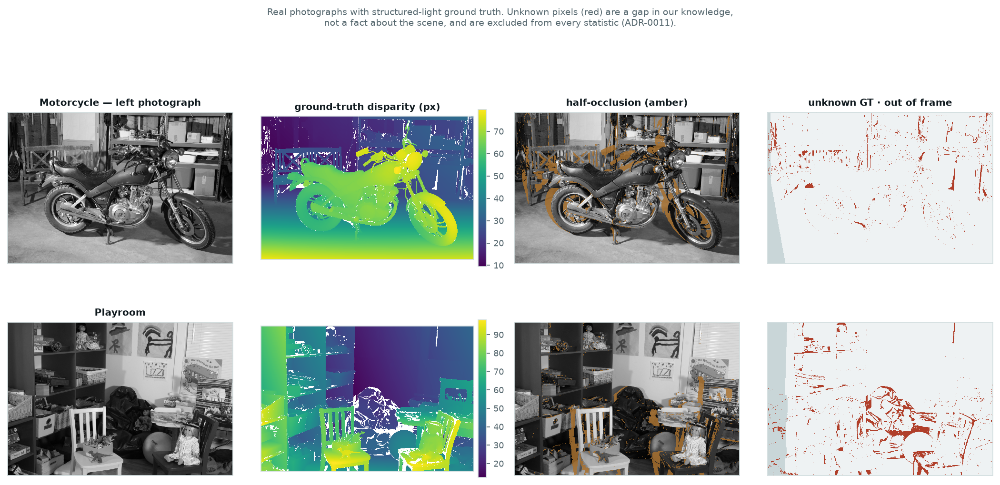
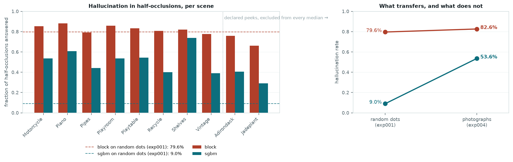
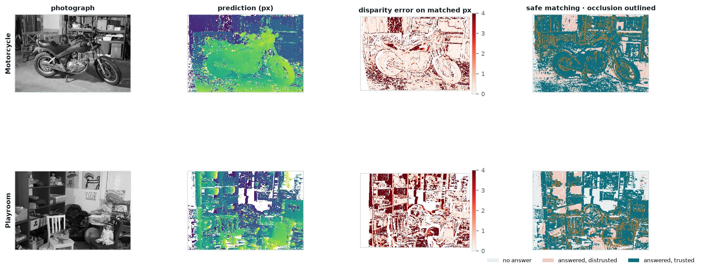
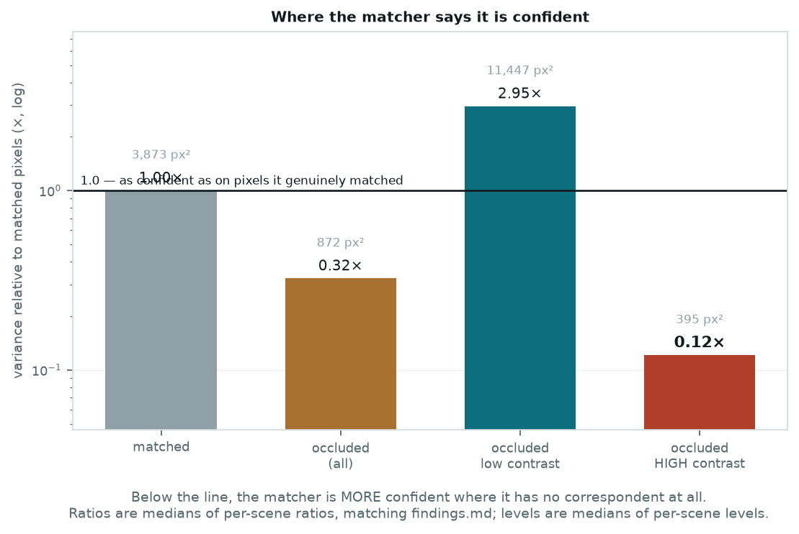
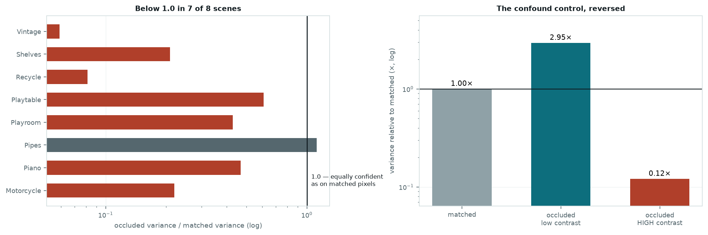
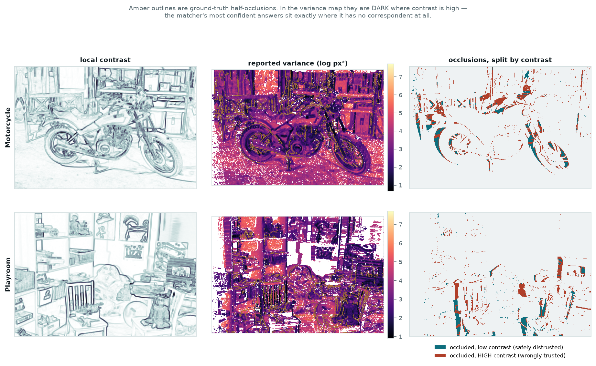
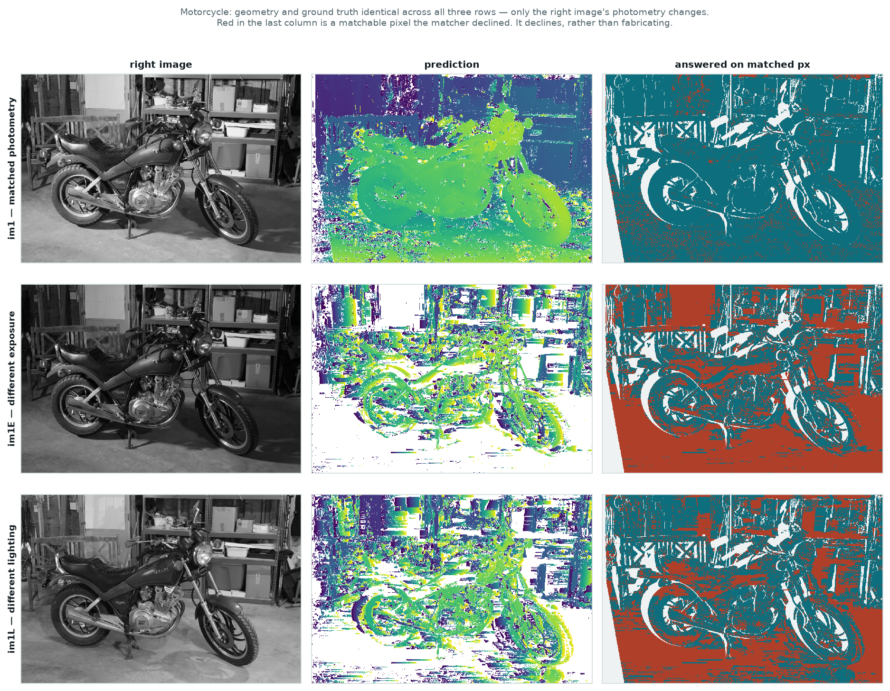
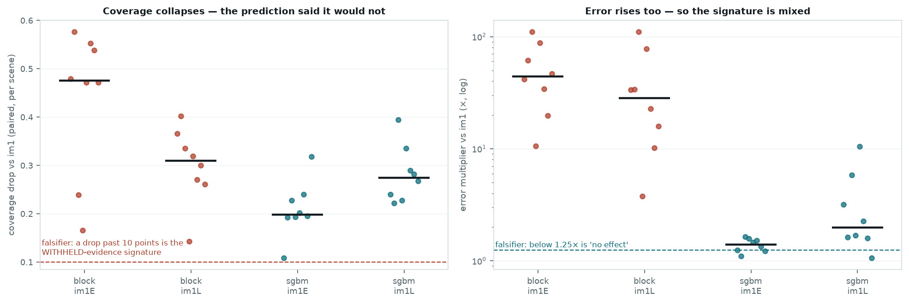
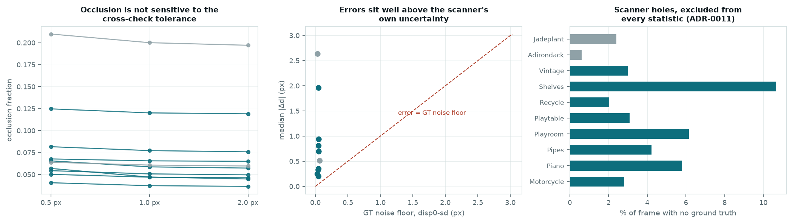

# exp004 — Real photographs · five slides

Source of truth for every number:
[`experiments/exp004_real_data_transfer/findings.md`](../../experiments/exp004_real_data_transfer/findings.md)
· run `exp004-20260818T213856-640b00e` · issue
[#6](https://github.com/visgraf/active-stereo/issues/6).

Middlebury 2014, `-perfect`, downsampled by 3. Medians over the **eight held-out
scenes**; Adirondack and Jadeplant were seen before the confirmatory run and are
excluded from every median. Figures are generated by
`scripts/make_exp004_slides.py`, which reads the run's `summary.json` rather than
recomputing — so a slide cannot disagree with the record.

"Trusted" in the panel maps means answered **and** reported variance within 10× the
matched-pixel baseline measured in the same frame. A display threshold for these
slides, not a value the pipeline uses.

---

## Slide 1 — The plan

### Motivation

exp001 used random-dot stereograms. exp003 used rendered charts. Both were built
by us, and exp003's own briefing booked the debt: *"a test chart is not a scene…
these results transfer to real imagery only insofar as real surfaces resemble flat
painted patches."*

This is the payment. Middlebury 2014 is **photographs of real objects with
structured-light ground truth** — the first stimulus family in this project whose
ground truth we did not author.

### Strategy — geometry fixed, photometry varying

Each scene ships three right images. `im1` matches the left photometrically;
`im1E` changes the **exposure**; `im1L` changes the **lighting**. Geometry, ground
truth and every mask are bit-identical across all three, so switching between them
varies brightness constancy and nothing else — the same "hold geometry fixed"
design as exp003, supplied by the corpus rather than built.

Two things the corpus forced, both recorded in
[ADR-0012](../../docs/decisions/0012-middlebury-real-data-corpus.md):

- **`doffs` is our vergence.** Middlebury's principal-point offset is
  algebraically the framework's vergence term, so `vergence = 2·arctan(doffs/2f)`
  is an identity. A calibrated physical rig, built by people with no stake in our
  modelling, is described by the off-axis model of ADR-0007.
- **A fourth mask.** A structured-light scanner leaves holes — 0.6% to 10.7% per
  scene. They are neither occluded nor out of frame; they are a gap in our
  *knowledge*. Charging them to occlusion would inflate the exact number this
  project argues from most ([ADR-0011](../../docs/decisions/0011-ground-truth-known-mask.md)).

### The three tests

| Test | Asks | Falsifier |
|---|---|---|
| **H1** | Does exp003's calibration asymmetry transfer? | variance ratio > 20×, or hallucination < 40% |
| **H1b** | Is variance *lower* in occlusion, not merely under-inflated? | ratio ≥ 1.0 in 3+ held-out scenes |
| **H2** | Does photometric mismatch *fabricate* evidence? | coverage drops > 10 pts, or error rises < 25% |

### Two declared peeks

Adirondack was run through both matchers while validating the loader; Jadeplant's
H2 verdicts were printed while smoke-testing the runner. Both are disclosed on
issue #6 **before** the confirmatory run, so the timestamps prove no threshold
moved, and both are excluded from every median. H1b was generated by the first
peek and carries less weight than a prediction made in advance.

---

## Slide 2 — Test 1: Does it transfer?

**H1 survives.** Block matching fills **82.6%** of ground-truth half-occlusions
with a confident answer. exp001 measured **79.6%** on random dots. Two stimulus
families with nothing in common — synthetic binary noise against photographs of
real objects — three points apart.

| matcher | coverage | bad-2.0 | median \|Δd\| | hallucination |
|---|---|---|---|---|
| block | 0.922 | 0.330 | 0.521 px | **0.826** |
| sgbm | 0.876 | 0.087 | 0.240 px | **0.536** |

### The result nobody predicted

| matcher | random dots (exp001) | photographs (exp004) |
|---|---|---|
| block | 79.6% | 82.6% |
| sgbm | **9.0%** | **53.6%** |

exp001's case for SGBM was that it *declines* where block matching guesses — 9.0%
against 79.6%, almost an order of magnitude. Block matching transfers within three
points. **SGBM degrades six-fold.** The one matcher this project could point to as
behaving honestly in half-occlusions does so largely on random dots.

Not pre-registered — it surfaced while cross-checking the findings draft against
exp001 — so it is an observation needing its own test
([#10](https://github.com/visgraf/active-stereo/issues/10)). It is also the single
most consequential number in the run, because exp001's recommendation rests on the
value that moved.

---

## Slide 3 — Test 2: Anti-calibration

exp003 found half-occlusions inflate variance only 5×, against 637× for texture
loss, and called the uncertainty badly calibrated. On photographs it is not
under-inflated. It is **inverted** — 0.32×, about three times *lower* than in
genuinely matched regions. Per-scene: 0.219, 0.468, 1.119, 0.428, 0.610, 0.081,
0.209, 0.059. One of eight reaches 1.0; the falsifier needed three.

So the framework does not merely fail to notice that it is fabricating. **It
reports fabricated estimates as its most confident ones** — and `fuse_mle` weights
by inverse variance, so these are precisely the measurements that dominate fusion.

### The control that could have killed this, and did the opposite

The pre-registered worry: Middlebury's occluded regions might simply be
low-contrast — shadowed, behind foreground objects — making this exp003's *texture*
effect wearing occlusion's clothing.

The confound is not merely absent, it is **reversed**. Low-contrast occlusions
inflate variance 2.95× and are discounted safely, exactly as exp003 describes. The
danger is **high**-contrast occlusions at 0.12× — 8.3× lower than matched on the
median scene, up to 34.5× on Vintage.

Which makes mechanical sense, and is the sharpest way to state the finding: a
half-occluded pixel beside a strong edge produces a **sharp, unambiguous cost
minimum at the wrong disparity**, and curvature-based variance reads that sharpness
as precision. Tens of thousands of pixels per scene — and high contrast is exactly
what a saliency-driven gaze policy selects for.

---

## Slide 4 — Test 3: Brightness constancy

The prediction, carried from exp003: photometric mismatch *fabricates* evidence,
so error rises while coverage stays flat.

Error rose. Coverage did not stay flat — it collapsed.

| matcher | variant | coverage drop | error multiplier | verdict |
|---|---|---|---|---|
| block | `im1E` | **−47.6 pts** | ×44.1 | falsified |
| block | `im1L` | **−31.0 pts** | ×28.2 | falsified |
| sgbm | `im1E` | **−19.8 pts** | ×1.4 | falsified |
| sgbm | `im1L` | **−27.5 pts** | ×2.0 | falsified |

**H2 falsified, in the direction that favours safety.** Under photometric mismatch
the matchers *decline* — uniqueness and consistency tests fail, coverage falls off
a cliff. That is the withheld-evidence signature, not the fabricated-evidence one.

The two matchers fail differently, and the split is worth keeping. SGBM mostly
declines: coverage drops 20–27 points while error on surviving answers rises only
1.4–2.0×. Block matching declines **and** degrades: coverage more than halves on
`im1E` *and* the survivors are 44× worse. So the signature is **mixed**, and the
prediction of a clean fabrication signature does not hold. Reported as falsified
rather than reinterpreted, on the same terms as exp003's H2b.

---

## Slide 5 — What this changes

1. **Occlusion detection is the highest-value thing to build.** Not because
   occluded estimates are insufficiently distrusted, but because they are
   *actively trusted more than correct ones*, and the effect concentrates where a
   gaze policy will look. → [#7](https://github.com/visgraf/active-stereo/issues/7)
2. **Curvature is the wrong variance proxy.** A sharp cost minimum means a
   well-localised match *given that a match exists*. It cannot express "there is no
   correspondent here", and in exactly that case it reports maximum confidence.
   Structural, not a tuning issue. → [#8](https://github.com/visgraf/active-stereo/issues/8)
3. **SGBM's variance is a constant** (`base_variance = 0.25`). Its H1 variance test
   could not fail and its H1b could not pass; both are flagged as vacuous in the
   run output. ADR-0005 requires a variance and never required it to carry
   information. → [#9](https://github.com/visgraf/active-stereo/issues/9)
4. **exp001's matcher recommendation needs revisiting**, given 9.0% → 53.6%.
   → [#10](https://github.com/visgraf/active-stereo/issues/10)
5. **For the paper**, the claim gets sharper and worse: not "poorly calibrated for
   fabricated evidence" but ***anti*-calibrated** — the confidence ordering is
   inverted precisely where it costs most.

---

## Caveats to keep on hand

- **Two declared peeks**, both disclosed before the confirmatory run and excluded
  from every median. Their values (0.759 and 0.662 against a held-out median of
  0.826) give no sign the peeks mattered — an observation, not a guarantee.
- **Downsampling by 3 is ours, not Middlebury's.** It is a low-pass filter, and it
  removes exactly the fine texture exp003 found decisive. bad-2.0 here is an
  order-of-magnitude check on the loader, not a leaderboard position.
- **Contrast is measured on the image**, because a photograph has no albedo pass.
  exp003 showed that conflates albedo texture with shading gradient, so the
  contrast split is coarser than exp003's equivalent.
- **No independent occlusion ground truth exists in this corpus.** `mask0nocc.png`
  is not distributed; our `matched` reproduces Middlebury's own generator exactly,
  which validates the implementation and not the 1.0 px threshold. The occlusion
  fraction moves by under half a point across 0.5/1.0/2.0 px.
- **Errors sit 7–15× above the ground-truth noise floor** from `disp0-sd.pfm`, so
  these are matcher errors, not scanner noise.
- **Ten scenes of indoor, static, diffuse-dominated tabletop imagery** is not XR
  content, and eight held-out scenes is a small n.
- **Block matching is a reference implementation**, not a competitive one. Its 33%
  bad-2.0 is expected and is not the finding.
