# exp007 · MiddEval3 visual results — raw and filled, every training pair

Visuals for [exp007](../../experiments/exp007_middeval3_training/findings.md)
(run `exp007-20260821T230639-65476a0`, issue
[#18](https://github.com/visgraf/active-stereo/issues/18)). Every composite
shows the left image and ground truth beside each matcher's **raw** output
(refusals in red) and its **background-filled** dense submission. Disparity
panels within a scene share one color scale from that scene's ground truth, so
panels are comparable by eye. The numbers in each title are the benchmark
SDK's dense bad% at t=0.5 (≈ official bad2.0).

Regenerate:

```bash
python scripts/make_exp007_figures.py
python scripts/build_deck.py slides/exp007_middeval3_training
```

---

## Slide 1 — The placement

| method | dense bad% (mean, 15 pairs) |
|---|---|
| published SOTA (test, official) | ~5–7 |
| SGM (benchmark's results, local ruler) | 24.2 |
| Census (same) | 28.9 |
| **ASsgbm** | **33.7** |
| **ASnrg** (energy) | **52.9** |
| **ASblk** (block) | **58.0** |

Nowhere near the leaderboard, and not expected to be — these are a
deliberately simple reference, OpenCV off the shelf, and a
two-experiment-old pathway. What the pictures add to that table: *how* each
one fails, and what the dense convention's fill actually does — it converts
red into plausible-looking viridis without adding knowledge. The benchmark
scores no uncertainty, so a calibrated refusal and a confident fabrication
are the same bad pixel.

---

## Slide 2 — Motorcycle, matched exposure: the baseline picture

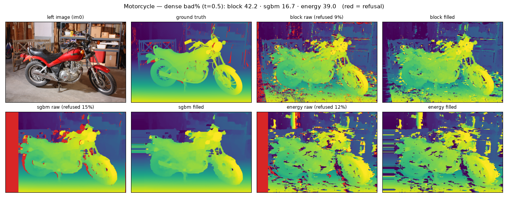

Each matcher's error *character* is legible. SGBM is smooth and coherent —
its filled map looks almost like ground truth even where it is wrong. Block
is coherent but blocky. Energy is accurate at the median with salt-and-pepper
gross outliers — the heavy tail from the quantile analysis, visible as
speckle. And the scanline fill's signature is already showing: horizontal
streaks wherever red used to be.

---

## Slide 3 — MotorcycleE: the money figure

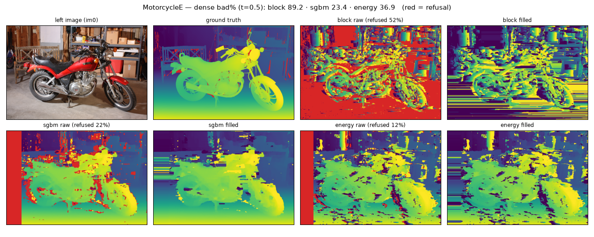

Same scene, same geometry, same ground truth — the right image was shot at a
different exposure. Block's raw panel is a sea of refusal over noise (52%
refused, 89.2 dense bad%); its filled panel is streaks invented from the
survivors. **The energy pathway's panels are nearly indistinguishable from
its matched-exposure result on the previous slide** — 36.9 dense bad% against
39.0 on Motorcycle. No degradation at all. This is exp002's exact gain
invariance as a picture, on a pair the benchmark itself designated, and it is
the one property of this pathway a leaderboard can see.

---

## Slide 4 — PianoL: gain invariance is not photometric invariance

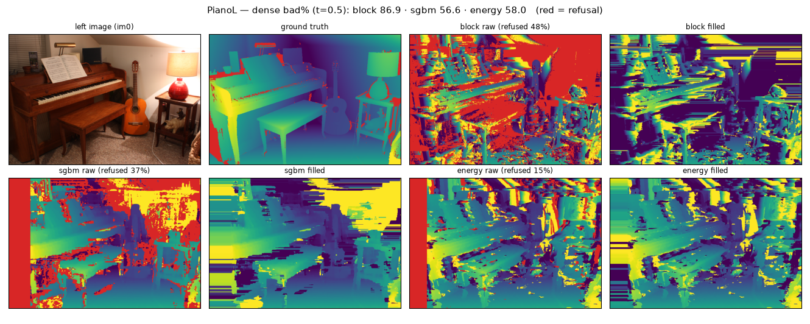

Here the *lighting* moved, not the exposure — shading and shadows changed,
which no gain factor models. Energy degrades too (58.0), but gracefully;
block collapses again (86.9, refusing 47%). The pair of photometric slides
brackets the claim precisely: a global gain is cancelled exactly, a moved
light source is not, and nothing principled says it should be.

---

## Slide 5 — Vintage: the corpus's hard scene, and energy's worst

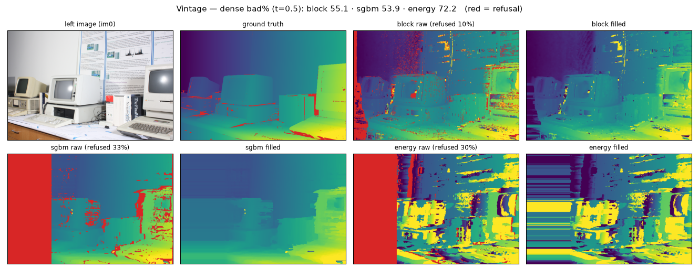

Energy's one decisive loss (72.2 vs block's 55.1): the featureless white
shelving carries no matchable structure at any of the bank's five scales, and
the readout answers anyway — 26% refusal, the rest heavily wrong. The same
scene was exp006's only per-scene validity failure; the benchmark agrees.

---

## Slide 6 — The rest of the corpus

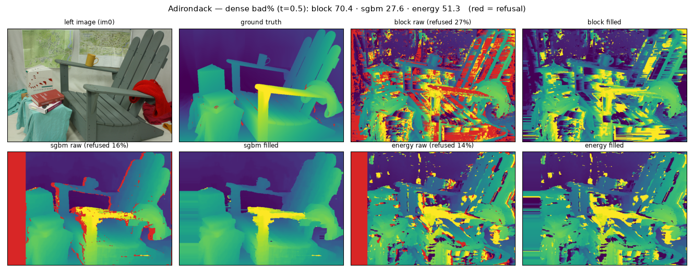

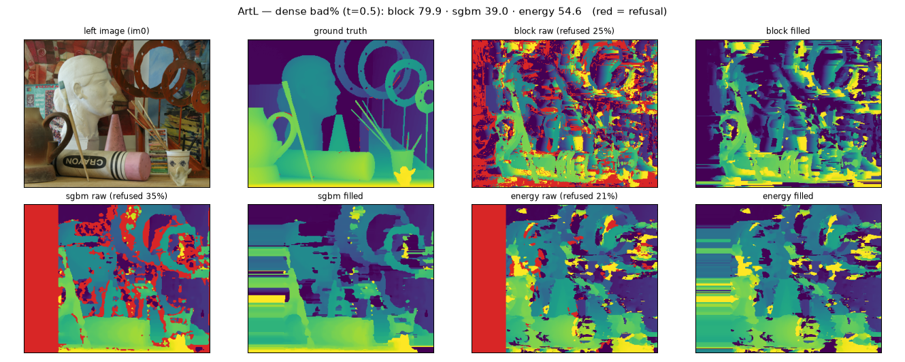

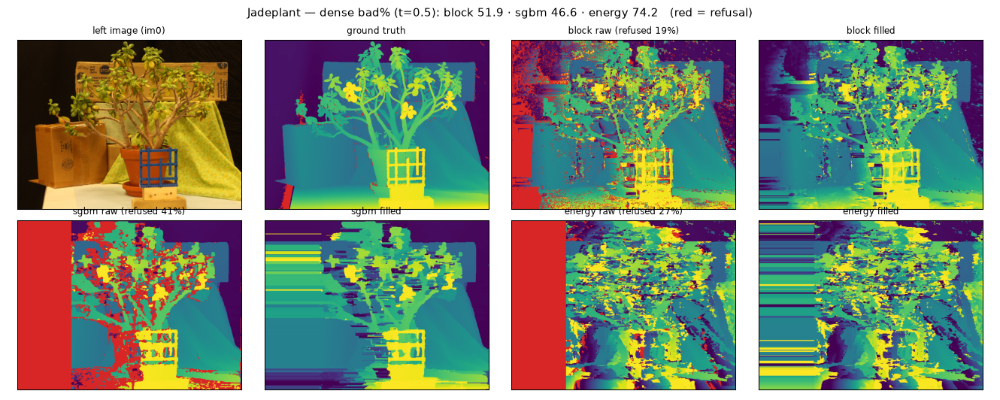

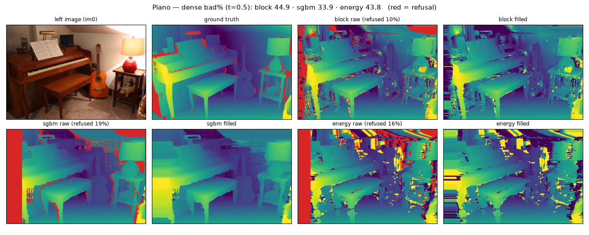

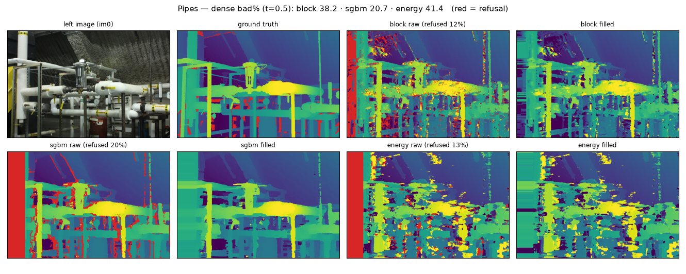

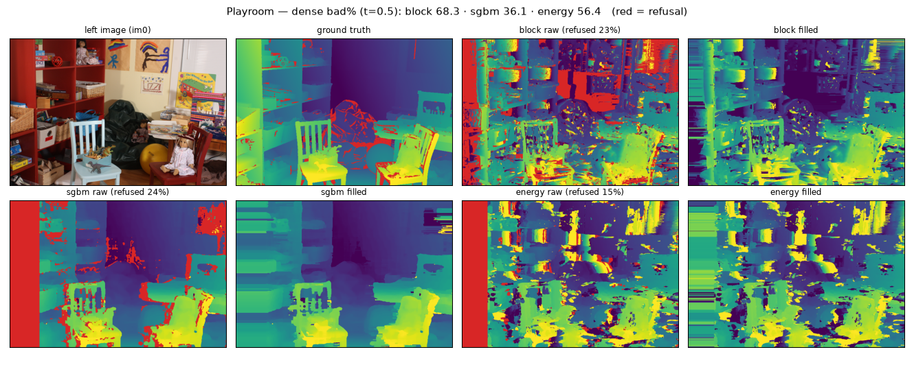

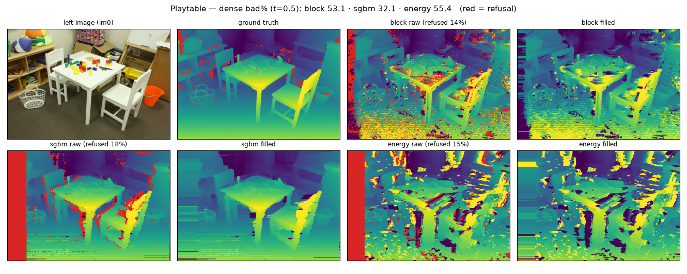

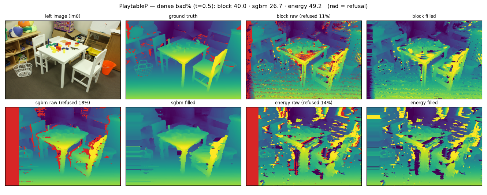

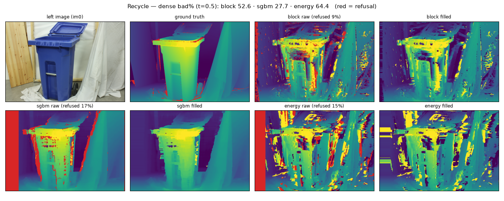

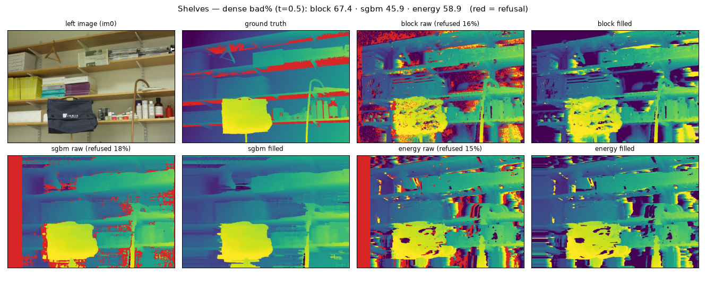

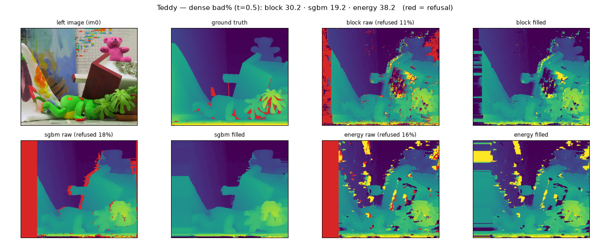

All fifteen composites, one per training pair; the per-scene tables behind
the title numbers are in the run's `summary.json` at both thresholds.
